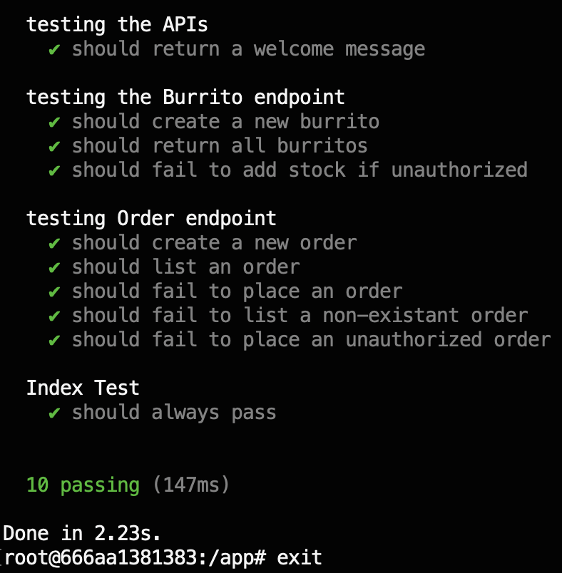

# Burrito Shop
APIs for my burrito shop's point of sales system


This project creates a backend set of APIs for the Burrito Shop. The project consists of two docker containers managed with Docker Compose, a NodeJS Express application and a MongoDB instance. The APIs are built in Typescript with Express targeting NodeJS v18. The APIs support orders for the Burrito Shop consisting of two primary endpoints:

`/api/burrito`

and

`/api/orders`

These endpoints allow CRUD operations for the store's stock as well as the placement and introspection of orders. The shop stock and orders are stored in MongoDB. The dabase modeling has proper relations ships between Burrito, OrderItem, and Order which are placed in the *models* folder. A burrito has a name, a sizePrices array detailing a size and a price, and an optionalIngredients array detailing a name and price. An order item has a reference to a burrito entity, a size, quantity and selectedIngredients. An order has an orderNumber, an array of order items, and an order total. The post routes are authenticated with an API key which needs to be included in the header, and when an order completes, if an ethereum address is included in the request body, the order's total is sent to the included wallet address denominated in REALM tokens.

## TL;DR

fill out all values in the .env.example file, then: 

```bash
docker compose up -d --build
docker ps
docker exec -it <name> bash
yarn test
exit
docker compose down
```

## Running the application:

This project uses Docker Compose to coordinate the nodejs container with the mongodb container. If using Compose V1 the command to bring up the application will be hyphenated: 

`docker-compose`

if using Compose V2 the command will be separated:

`docker compose`

Run docker compose up to start the application:

`docker-compose up -d --build`

To stop the application run docker-compose down

`docker-compose down`

#### NOTE ABOUT ENV VALUES

*The .env values need to be filled out for the ethereum transactions to work. Copy in a fully formed .env file **as** the .env.example file or add the appropriate values to the .env.example file. The .env.example file will be copied as the .env file during build and runtime execution.*

## Accessing the API endpoints

There are a few ways to engage the APIs:

* Bring up the containers
* Execute the tests on the NodeJS container

or

* Bring up the containers
* Locally engage the APIs from Postman or the browser

or

* Bring up the containers
* Locally engage the APIs
* Execute the tests

or

* Run a local instance of MongoDB
* Run a local instance of the Node app
* Locally engage the APIs

note that the application ports will be different if running locally than the docker container. The docker container will map port 80 to port 3000. This means that when engaging the APIs with the docker container, the endpoints are: 

`http://localhost/api/`

when running the app locally:

`http://localhost:3000/api/`

## Running the test suite

Build the containers and run:

`docker compose up -d --build`

Get the container name for the node application:

`docker ps`

Log in to the container with an interactive terminal:

`docker exec <Container Name> -it bash`

from the bash terminal in the node container:

`yarn test`

`exit`

`docker compose down`

the following output is printed to the console:



## Engaging the APIs from the containers

` docker compose up -d --build`

The mongodb instance will be seeded with store stock

`curl -L localhost/api/burrito`

When using Postman the api key will need to be added to the headers:

key: X-Api-Key

value: 123456

An order can be created with the following JSON body:

```JSON
{
    "order": [
        { "burrito": "Al Pastor", "size": "XL", "quantity": 2 },
        { "burrito": "Carne Asada", "size": "XL", "quantity": 1 },
        { "burrito": "Chicken", "size": "Regular", "quantity": 1 },
        { "burrito": "Fish", "size": "Regular", "quantity": 3, "selectedIngredients": [{ "name": "Black Olives", "price": 2 }]}
    ]
}
```

Once the order is created, calling the completed endpoint with the order number and an ethereum address in the request body will send REALM tokens to the address:

`http://localhost/api/orders/complete/1`

```JSON
{
    "ethereumAddress": "0xa3d6...1dca"
}
```
*Note that the test suite will delete the collections from the database. So running the test suite and then engaging the APIs will result in no store stock.*

It is recommended to engage the APIs upon start up, and then log into the node container to run the test suite. Or bring down the containers and bring them back up.

## Running locally

If running locally the connection to the database must be changed from the container to the instance running locally. Within the config folder, the db.ts file needs to be updated to:

```Typescript
// const url = process.env.MONGO_DB_URI as string;
const url = 'mongodb://localhost:27017/test';
```

To start the application navigate to the root of the project directory and run:

`yarn start`

This will copy the requisite files, compile the typescript, and start the application.

Again, the API endpoint will need the port 3000 designation:

`http://localhost:3000/api/`

## API Layout

The following APIs are available:

GET `/api/burrito`

lists the store stock of available burritos:

```JSON
{
    "count": 0,
    "burritos": []
}
```

POST `/api/burrito` { headers: {X-Api-Key: 'secret_key'} }

an authenticated endpoint that adds new stock to the store:

```JSON
{
    "name": "Al Pastor",
    "sizePrices": [{ "size": "Regular", "price": 10}, {"size": "XL", "price": 12}],
    "optionalIngredients": [
        { "name": "Black Olives", "price": 2 },
        { "name": "Rice", "price": 1 },
        { "name": "Sour Cream", "price": 3 }
    ] 
}
```

GET `/api/orders`

lists all open orders

GET `/api/orders/:id`

list order details for a specific order number:

```JSON
{
    "_id": "66abda71438db9e159a33383",
    "total": 99,
    "items": [
        {
            "burritoName": "Al Pastor",
            "size": "XL",
            "quantity": 2,
            "price": 12,
            "selectedIngredients": []
        },
        ...
    ]
}
```

POST `/api/orders` { headers: {X-Api-Key: 'secret_key'} }

an authenticated endpoint that adds a new order:

```JSON
{
    "order": [
        { "burrito": "Al Pastor", "size": "XL", "quantity": 2 },
        { "burrito": "Carne Asada", "size": "XL", "quantity": 1 },
        { "burrito": "Chicken", "size": "Regular", "quantity": 1 },
        { "burrito": "Fish", "size": "Regular", "quantity": 3, "selectedIngredients": [{ "name": "Black Olives", "price": 2 }]}
    ]
}
```

POST `/api/orders/complete/:id` { headers: {X-Api-Key: 'secret_key'} }

an authenticated endpoint that completes an order:

```JSON
{
    "ethereumAddress": "0xa3d6...1dca"
}
```

This will clear the order from the database. If included with a valid ethereum address in the request body, an ethereum transaction will be made to send the order total in **REALM** tokens to the included ethereum address. This token contract is deployed to Base Sepolia, and will transfer the whole number of dollars listed for the order total in equivalent **REALM** tokens, e.g. for an order total of $99 a transactions for 99 * 10e18 tokens will be transferred to the wallet address. 

The transaction hash will be printed to the console, which is not visible from the browser, however the contract address can be viewed from an explorer at:

[contract](https://base-sepolia.blockscout.com/address/0x258282B4Ed0f4b68F8BEEb06208FC7da4BDA46FC)

## Testing Suite

There was great effort into using Jest to test the API application, however the interaction with Jest and Typescript made this too time consuming to pursue for this project. The Mocha/Chai testing framework was chosen for the unit test suite in combination with supertest. Determining the exact Typescript and Jest setting is left as a future endeavour. The test suite covers the API functionality *except* for the completion endpoint. 

## Environment File

A note about the .env file. The complete .env is not included in the repo because this is an application security concern. An example .env file is included in the repo which will be copied when the container starts. However, the example values are **NOT** complete, and will need all values for the application to make successful blockchain transactions, as the private key is missing from the example file.

## Additional Notes

This medium post was helpful in overcoming the Silicon Mongo issue and is included for attribution:
[article](https://medium.com/@b.watcharachai/install-mongodb-on-mac-arm-apple-chip-m1-m2-7045bc44f483)